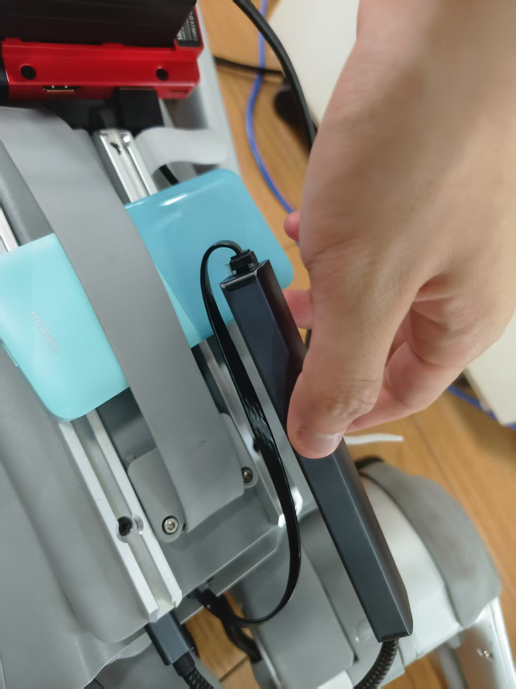

# NavGPT
## 克隆远程git仓库到本地
  git clone https://github.com/GengzeZhou/NavGPT.git
## Data Preparation
  从[Dropbox](https://www.dropbox.com/sh/i8ng3iq5kpa68nu/AAB53bvCFY_ihYx1mkLlOB-ea?dl=1)下载R2R数据集，解压到`datasets`，注意`datasets`下第一个文件夹名称是`R2R`，`R2R`里面的才是数据集
## Installation
  1.确保下载了anaconda  
  2.创建虚拟环境并下载相应的包  
  ```python
   conda create --name NavGPT python=3.9  
   conda activate NavGPT  
   pip install -r requirements.txt
  ```
## API调用
  参考[https://chatanywhere.apifox.cn/doc-5547696](https://chatanywhere.apifox.cn/doc-5547696)  
  针对本工程，如果用openai的话在`agent.py`中添加如下代码
  ```python
   import os
   os.environ["OPENAI_API_KEY"] = "your 密钥"
   os.environ["OPENAI_API_BASE"] = "https://api.chatanywhere.tech/v1"
  ```
## 测试
  参考NavGPT的readme文件  
  比较经济的方式：  
  ```python
   cd nav_src
   python NavGPT.py --llm_model_name gpt-3.5-turbo \
    --output_dir ../datasets/R2R/exprs/gpt-3.5-turbo-test \
    --val_env_name R2R_val_unseen_instr \
    --iters 10
  ```


# robot-dog-control
## preparation
  机器狗上下载[unitree_sdk2_python](https://support.unitree.com/home/zh/developer/Python)（已装好）
## usage
  因宇树科技不当人只支持有线开发，如果本机和机器狗连同一个wifi也没法直接控制。我们需要一些trick,用一根短网线让机器狗自己连通自己，如下图所示：
  
  
  
## example
  控制机器狗的例程client.py只能在机器狗上的小主机上运行，网络端口填eth0，注意测试机器狗趴下又站起来后机器狗的关节会锁定，如果想让它move的话需要先解除锁定
## NavGPT
  新增机器狗模式，机器狗主机上运行server文件监听NavGPT的action，本机在NavGPT环境下执行
  ```python
  python NavGPT.py --llm_model_name gpt-4o-ca \    --output_dir ../datasets/R2R/exprs/gpt-3.5-turbo-test \    --val_env_name robotdog \    --iters 1 --agent_mode robot_dog 
  ```
